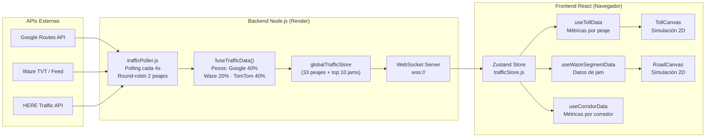
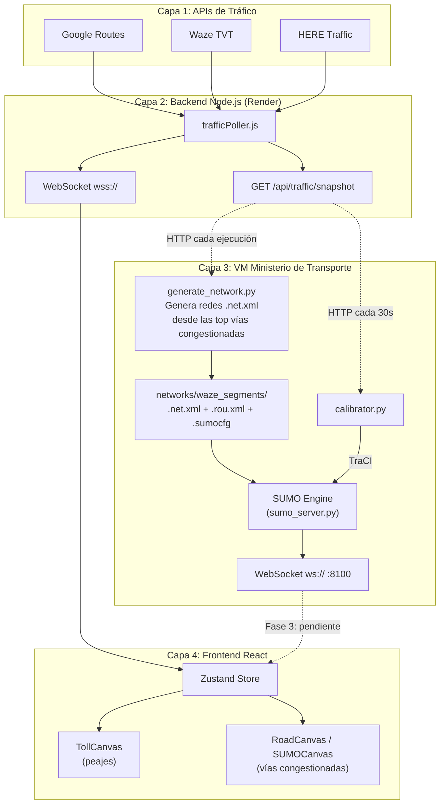

# VIITS-NEXUS — Gemelo Digital de Tráfico Vehicular

**Ministerio de Transporte de Colombia · DITRA · INVÍAS**
**Versión:** 2.1 — Integración SUMO Eclipse
**Fecha:** 30 de abril de 2026

---

## 1. Descripción General

VIITS-NEXUS es un sistema de monitoreo de congestión vehicular en tiempo real que opera como **gemelo digital** de los principales corredores viales de Colombia. El sistema fusiona datos de múltiples APIs de tráfico (Google Routes, Waze TVT, HERE Traffic) para visualizar las condiciones de la red vial nacional las 24 horas del día, los 7 días de la semana.

### Capacidades del sistema

| Capacidad | Descripción |
|---|---|
| **Monitoreo 24/7** | 7 corredores, 33 peajes, tabla de vías congestionadas en tiempo real |
| **Fusión multi-API** | Google Routes (40%), Waze TVT (20%), HERE Traffic — pesos ponderados |
| **Simulación visual** | Vehículos animados por carril con físicas de colisión y frenado |
| **Alertas inteligentes** | Accidentes, cierres viales, congestión crítica con severidad |
| **Inteligencia 3D** | Mapa de calor de accidentalidad con hotspots por IRA (Índice de Riesgo) |
| **Modo operación** | Calendario DITRA: éxodo, retorno progresivo, bidireccional |

---

## 2. Estructura del Proyecto

```
viits-gemelo/
│
├── server.js                          ← Servidor Express producción (puerto 3000)
├── package.json                       ← Dependencias Node.js (React, Leaflet, Recharts)
├── ecosystem.config.js                ← Configuración PM2 para operación 24/7
│
├── 📁 backend/                        ← Lógica del servidor Node.js
│   ├── websocketServer.js             ← Servidor WebSocket (wss://) para streaming
│   ├── 📁 services/
│   │   └── trafficPoller.js           ← 🧠 Motor de polling multi-API (Google/Waze/HERE)
│   ├── 📁 data/
│   │   └── nexusCorridorsData.js      ← Datos maestros: 7 corredores, 33 peajes, coordenadas
│   ├── 📁 config/
│   │   └── operationCalendar.json     ← Calendario DITRA de operaciones viales
│   └── 📁 scripts/
│       └── processDitraExcel.js       ← Procesador de datos Excel del DITRA
│
├── 📁 src/                            ← Frontend React (SPA)
│   ├── App.js                         ← Router principal (React Router v7)
│   ├── index.js                       ← Punto de entrada React
│   ├── index.css                      ← Estilos globales
│   │
│   ├── 📁 store/
│   │   └── trafficStore.js            ← Estado global (Zustand) — recibe datos vía WebSocket
│   │
│   ├── 📁 hooks/
│   │   ├── useTrafficAPI.js           ← Hook de polling de tráfico (fallback HTTP si WS falla)
│   │   ├── useCorridorData.js         ← Generador de métricas por corredor (IRT, flujo, velocidad)
│   │   ├── useGlobalAlerts.js         ← Agregador de alertas (accidentes, congestión, cierres)
│   │   └── useAccidentData.js         ← Datos de accidentalidad histórica (hotspots DITRA)
│   │
│   ├── 📁 data/
│   │   ├── nexusCorridors.js          ← Configuración maestra frontend: corredores + peajes
│   │   ├── corridors.js               ← Polígonos de corredores para mapas
│   │   ├── accidentUtils.js           ← Utilidades IRA (Índice de Riesgo de Accidentabilidad)
│   │   └── hotspots_processed.json    ← Hotspots de accidentalidad pre-procesados
│   │
│   ├── 📁 utils/
│   │   └── operationMode.js           ← Resolución de modo operación (éxodo/retorno/bidireccional)
│   │
│   ├── 📁 pages/
│   │   ├── ModuleSelector.jsx         ← Pantalla de selección de módulos
│   │   ├── 📁 Welcome/               ← Pantalla de bienvenida animada
│   │   ├── 📁 Monitor/               ← 🖥️ Panel principal NEXUS (7 corredores + mapa + alertas)
│   │   │   ├── index.jsx             ← Componente principal del Monitor
│   │   │   └── LoadingScreen.jsx     ← Pantalla de carga con animaciones
│   │   ├── 📁 AccidentAnalyzer/       ← Analizador 3D de accidentalidad
│   │   │   └── index.jsx             ← Mapa de calor 3D con hotspots IRA
│   │   └── 📁 PeajeChuzaca/          ← Piloto original (módulo legacy)
│   │       └── hooks/useSensorData.js ← Datos simulados del piloto Chuzacá
│   │
│   └── 📁 modules/
│       ├── 📁 toll/                   ← Módulo de peajes individuales
│       │   ├── TollPage.jsx           ← Página de detalle de un peaje
│       │   ├── 📁 components/
│       │   │   └── TollCanvas.jsx     ← 🎬 Motor de renderizado 2D — vehículos por carril
│       │   └── 📁 hooks/
│       │       └── useTollData.js     ← Métricas de peaje (API + Greenshields)
│       │
│       ├── 📁 corridor/              ← Módulo de corredores
│       │   ├── CorridorPage.jsx       ← Página de detalle de un corredor (todos sus peajes)
│       │   └── 📁 components/
│       │       └── TollStationCard.jsx ← Tarjeta resumen de cada peaje en el corredor
│       │
│       └── 📁 waze/                   ← Módulo de tramos congestionados Waze
│           ├── WazeSegmentPage.jsx    ← Página de detalle de una vía congestionada
│           ├── useWazeSegmentData.js  ← Transformador de jam Waze → formato Canvas
│           └── 📁 components/
│               └── RoadCanvas.jsx     ← 🎬 Motor de renderizado 2D — 3 carriles genéricos
│
├── 📁 sumo-engine/                    ← 🆕 Motor SUMO Eclipse (microsimulación)
│   ├── Dockerfile                     ← Imagen Docker: Ubuntu 22.04 + SUMO + Python + FastAPI
│   ├── docker-compose.yml             ← Orquestación del contenedor SUMO
│   ├── requirements.txt               ← Dependencias Python (FastAPI, TraCI, httpx)
│   ├── sumo_server.py                 ← 🧠 Servidor FastAPI + TraCI + WebSocket streaming
│   ├── calibrator.py                  ← 🔗 Bridge Google/Waze → calibradores SUMO
│   ├── 📁 scripts/
│   │   └── generate_network.py        ← 🗺️ Generador de redes viales desde Waze TVT + OSM
│   ├── 📁 config/                     ← Archivos .sumocfg (uno por vía congestionada)
│   └── 📁 networks/
│       └── 📁 waze_segments/          ← Redes .net.xml generadas por vía congestionada
│           ├── 📁 <jam_hash_id>/
│           │   ├── <id>.osm           ← Datos OSM descargados
│           │   ├── <id>.net.xml       ← Red SUMO con geometría real
│           │   ├── <id>.rou.xml       ← Tipos vehiculares colombianos
│           │   └── polyline.json      ← Polyline original de Waze
│           └── manifest.json          ← Registro de todas las redes generadas
│
├── 📁 build/                          ← Build de producción (React → static)
├── 📁 public/                         ← Assets estáticos
│   └── 📁 data/
│       └── waze_hourly_snapshot.json   ← Snapshot horario de accidentes Waze
└── 📁 data/                           ← Datos procesados (Excel DITRA, etc.)
```

---

## 3. Flujo de Datos del Sistema

### 3.1 Pipeline de Datos en Tiempo Real



### 3.2 Ciclo de Actualización

| Paso | Componente | Intervalo | Descripción |
|------|-----------|-----------|-------------|
| 1 | `trafficPoller.js` | 4 seg | Consulta 2 peajes en round-robin (Google Routes + Waze TVT + HERE) |
| 2 | `fuseTrafficData()` | — | Fusiona los datos con pesos ponderados, aplica correcciones por accidentes y cierres |
| 3 | `WebSocket` | 4 seg | Broadcast a todos los clientes conectados (`traffic_update`) |
| 4 | `trafficStore.js` | — | Actualiza el estado global Zustand en el navegador |
| 5 | `useTollData.js` | — | Recalcula métricas (velocidad, flujo, cola, IRT) para el peaje abierto |
| 6 | `TollCanvas.jsx` | 60 fps | Renderiza vehículos animados con físicas de colisión |

### 3.3 Cache y Protección Financiera

| API | Cache TTL | Razón |
|-----|----------|-------|
| Google Routes | **1 hora** | Cada request cuesta ~$0.01 USD. Con 33 peajes = $7.92/día si se llama cada 5 min |
| Waze TVT/Feed | **1 hora** | Rate limit del partner hub de Waze |
| HERE Traffic | **1 hora** | Capa de incidentes, no requiere alta frecuencia |

---

## 4. Componentes Clave

### 4.1 TollCanvas — Motor de Simulación de Peajes

`src/modules/toll/components/TollCanvas.jsx` (~51 KB, ~1,260 líneas)

Motor de renderizado 2D usando la Canvas API nativa del navegador. Simula vehículos por carril con:
- **Físicas de car-following**: gap mínimo, frenado proporcional a distancia, aceleración gradual
- **Protección de spawn**: zona de inyección libre de colisiones antes de generar nuevos vehículos
- **Casetas de peaje**: puntos de frenado donde los vehículos reducen velocidad
- **Tipos vehiculares**: autos, buses, camiones, motos — con colores y tamaños distintos
- **Datos API-driven**: la velocidad y flujo responden a los datos reales de Google/Waze

### 4.2 RoadCanvas — Motor de Vías Congestionadas

`src/modules/waze/components/RoadCanvas.jsx` (~11 KB, ~300 líneas)

Motor de renderizado 2D simplificado para tramos congestionados de Waze:
- **3 carriles fijos** horizontales (sin geometría real de la vía)
- Velocidad controlada por `jamLevel` y `jamSpeed` de Waze
- Sin casetas de peaje (es un tramo abierto)

> [!WARNING]
> **Limitación actual**: RoadCanvas dibuja carriles rectos genéricos independientemente de la geometría real de la vía. Una curva cerrada en la Ruta del Sol se ve igual que una recta en la Autopista Sur. **Esta es la razón principal para integrar SUMO.**

### 4.3 trafficPoller — Motor de Datos

`backend/services/trafficPoller.js` (~305 líneas)

Orquestador del backend que:
1. Hace polling a Google Routes API (computeRoutes con TRAFFIC_AWARE)
2. Descarga el feed de alertas Waze (accidentes, peligros)
3. Obtiene jams del Waze TVT (Traffic View Timeline)
4. Consulta incidentes de HERE Traffic
5. Fusiona todo con `fuseTrafficData()` usando pesos ponderados
6. Broadcast vía WebSocket a todos los clientes

### 4.4 operationMode — Calendario DITRA

`src/utils/operationMode.js` (~297 líneas)

Resuelve el modo de operación actual según el calendario de la DITRA:
- **Éxodo**: 80% casetas salida, 20% retorno (Semana Santa)
- **Retorno progresivo**: casetas de retorno se habilitan gradualmente
- **Bidireccional**: 60/40 salida/retorno (días laborales normales)

---

## 5. Cambios Realizados — Integración SUMO Eclipse

### 5.1 ¿Qué es SUMO Eclipse?

**SUMO (Simulation of Urban Mobility)** es un simulador microscópico de tráfico open-source mantenido por la Eclipse Foundation (originalmente del DLR Alemán). A diferencia de nuestro motor Canvas actual (que simula carriles rectos genéricos), SUMO:

- **Importa redes viales reales** desde OpenStreetMap: curvas, pendientes, intersecciones, rampas
- **Usa modelos vehiculares científicos** (Krauss, IDM) validados internacionalmente
- **Simula cada vehículo como un agente** con posición, velocidad, aceleración y cambio de carril
- **Permite calibración en tiempo real** con datos externos (Google/Waze) vía TraCI

### 5.2 ¿Por qué integramos SUMO?

El sistema actual funciona correctamente para los **33 peajes** donde TollCanvas simula el flujo vehicular con casetas. Sin embargo, cuando el usuario hace click en una **vía congestionada** de la tabla "Top Puntos de Congestión Críticos" del Monitor, se abre `WazeSegmentPage` que usa `RoadCanvas` — un motor genérico de 3 carriles rectos que **no refleja la geometría real de la vía**.

SUMO resuelve esto: la simulación de cada vía congestionada usará la **cartografía real de OpenStreetMap**, mostrando las curvas, carriles, intersecciones y rampas tal como existen en el terreno.

### 5.3 Archivos Creados

| Archivo | Tamaño | Función |
|---------|--------|---------|
| `sumo-engine/sumo_server.py` | 15 KB | Servidor FastAPI con TraCI controller. Arranca SUMO, ejecuta la simulación paso a paso, y transmite posiciones vehiculares (lon, lat, speed, angle, tipo) vía WebSocket a 2 fps. Incluye modo simulado para desarrollo local sin SUMO instalado. |
| `sumo-engine/calibrator.py` | 6.5 KB | Bridge entre el backend NEXUS existente y SUMO. Cada 30 seg consulta `/api/traffic/snapshot` para obtener datos fusionados de Google/Waze/HERE y ajusta los tramos SUMO con velocidades y flujos reales (modelo Greenshields). |
| `sumo-engine/scripts/generate_network.py` | 10 KB | Generador dinámico de redes SUMO. Consulta las **top 10 vías congestionadas** del Monitor NEXUS (Waze TVT), descarga la cartografía real de OpenStreetMap para cada una, y genera redes `.net.xml` con `netconvert`. Cachea por hash de polyline. |
| `sumo-engine/Dockerfile` | 1.6 KB | Imagen Docker: Ubuntu 22.04 + PPA oficial de SUMO + Python 3.11 + FastAPI. Puerto 8100. |
| `sumo-engine/docker-compose.yml` | 1.7 KB | Orquestación del contenedor SUMO. Límites: 2 CPU / 2 GB RAM. Conecta al backend NEXUS vía `host.docker.internal`. |
| `sumo-engine/requirements.txt` | 333 B | Dependencias Python: FastAPI, uvicorn, traci, libsumo, httpx, orjson. |

### 5.4 Archivos Modificados

| Archivo | Cambio |
|---------|--------|
| `server.js` | El endpoint `GET /api/traffic/snapshot` ahora incluye `nationalWazeJams` reales (antes devolvía `[]`). Esto permite que `generate_network.py` obtenga las vías congestionadas activas. |

---

## 6. Arquitectura con SUMO



---

## 7. ¿Para Qué se Usa la VM del Ministerio?

La VM proporcionada por el Ministerio de Transporte se utiliza exclusivamente para ejecutar el **motor de microsimulación SUMO Eclipse**, que requiere:

### 7.1 ¿Por qué no puede correr en Render?

| Requisito de SUMO | Render (plan actual) | VM del Ministerio |
|---|---|---|
| Binario `sumo` instalado (C++, ~200 MB) | ❌ No se puede instalar software arbitrario | ✅ Control total del SO |
| Proceso persistente (simulación 24/7) | ❌ Free tier mata procesos inactivos | ✅ Uptime garantizado |
| 2 GB RAM para simulación vehicular | ⚠ Limitado en free tier | ✅ Recursos dedicados |
| Acceso a sistema de archivos (redes .net.xml) | ⚠ Ephemeral filesystem | ✅ Persistente |

### 7.2 ¿Qué ejecuta la VM?

```
┌──────────────────────────────────────────────────────────┐
│  VM del Ministerio de Transporte                          │
│                                                           │
│  ┌─────────────────────────────────────────────────────┐  │
│  │  Docker Container: viits-sumo-engine                │  │
│  │                                                     │  │
│  │  1. SUMO (binario C++) — motor de microsimulación   │  │
│  │  2. sumo_server.py — FastAPI + TraCI controller     │  │
│  │  3. calibrator.py — sincroniza datos reales         │  │
│  │  4. networks/ — redes viales de OSM                 │  │
│  │                                                     │  │
│  │  Puerto: 8100 (WebSocket + REST API)                │  │
│  └─────────────────────────────────────────────────────┘  │
│                                                           │
│  Consume: ~2 CPU, ~2 GB RAM                               │
│  Red: Conecta al backend NEXUS en Render                  │
└──────────────────────────────────────────────────────────┘
```

### 7.3 Flujo de Trabajo con la VM

```
1. SETUP (una vez):
   ├── Instalar Docker en la VM
   ├── Clonar el repo viits-gemelo
   └── docker-compose up -d  (levanta el contenedor SUMO)

2. GENERACIÓN DE REDES (periódicamente o bajo demanda):
   └── python3 generate_network.py --backend https://nexus.onrender.com
       ├── Consulta las top 10 vías congestionadas actuales
       ├── Descarga cartografía OSM de cada zona
       ├── Convierte a red SUMO (.net.xml)
       └── Genera manifest.json

3. OPERACIÓN 24/7 (automático):
   ├── sumo_server.py ejecuta la simulación continuamente
   ├── calibrator.py sincroniza velocidades/flujos desde Google/Waze cada 30s
   └── WebSocket :8100 transmite posiciones vehiculares al frontend
```

---

## 8. Glosario de Términos Técnicos

| Término | Significado |
|---------|-------------|
| **IRT** | Índice de Riesgo de Tráfico — escala 0–100 que mide congestión |
| **IRA** | Índice de Riesgo de Accidentabilidad — escala 0–100 para hotspots |
| **TraCI** | Traffic Control Interface — API TCP de SUMO para control en tiempo real |
| **netconvert** | Herramienta SUMO que convierte mapas OSM a redes de simulación |
| **netedit** | Editor visual de redes SUMO (para curar geometría vial) |
| **Greenshields** | Modelo matemático de flujo-densidad vehicular (parábola Q-k) |
| **Car-following** | Modelo de comportamiento vehicular: cada vehículo sigue al de adelante |
| **Jam Level** | Nivel de congestión Waze (0=libre, 3=moderado, 5=gridlock) |
| **DITRA** | Dirección de Tránsito y Transporte — MinTransporte Colombia |
| **TVT** | Traffic View Timeline — feed de congestión de Waze |
| **.net.xml** | Formato de red vial de SUMO (nodos + aristas + carriles) |
| **.rou.xml** | Formato de demanda vehicular de SUMO (tipos + rutas + flujos) |
| **.sumocfg** | Archivo de configuración que une la red + demanda + parámetros |

---

## 9. Estado Actual y Próximos Pasos

### Completado ✅

- [x] Motor de polling multi-API (Google/Waze/HERE) operativo 24/7
- [x] Simulación visual de 33 peajes con TollCanvas (API-driven)
- [x] Tabla de vías congestionadas Top Waze TVT en el Monitor
- [x] Analizador 3D de accidentalidad con hotspots IRA
- [x] Backend SUMO (sumo_server.py + calibrator.py + Dockerfile)
- [x] Generador de redes para vías congestionadas (generate_network.py)
- [x] Endpoint HTTP corregido para exponer nationalWazeJams

### Pendiente ⬜

- [ ] **Fase 2**: Instalar SUMO en la VM y ejecutar generate_network.py
- [ ] **Fase 3**: Crear proxy WebSocket en server.js para conectar frontend ↔ SUMO VM
- [ ] **Fase 4**: Crear componente `SUMOCanvas.jsx` que reemplace a `RoadCanvas` con geometría real
- [ ] **Fase 5**: Deploy Docker en la VM y validación end-to-end

---

*Documento generado para el equipo VIITS — Ministerio de Transporte de Colombia*
*Contacto técnico: Dirección de Tránsito y Transporte (DITRA)*
